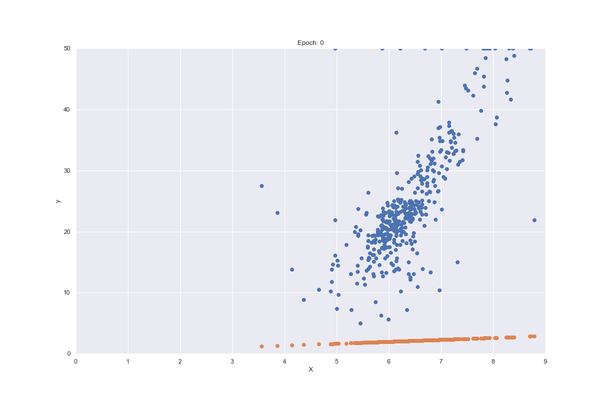

# Boston house price prediction
## Dataset: from scikit learn toy dataset (https://scikit-learn.org/stable/datasets/toy_dataset.html).
## Approaches: Gradient descent, Linear regression, Polynomial regression and Random forest.
> Check the number of epochs vs model prediction GIFs, I used gradient descent there to find the optimal values for parameters w and b to minimize the cost function.

