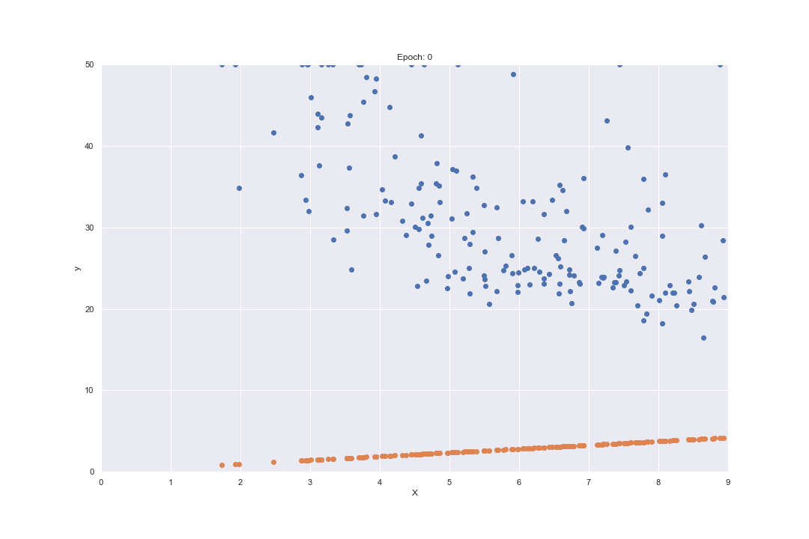

# Boston house price prediction
## Dataset: [Boston Housing Prices Dataset](https://scikit-learn.org/stable/modules/generated/sklearn.datasets.load_boston.html)
## Approaches: Gradient descent, Linear regression, Polynomial regression and Random forest.
**Check the number of epochs vs model prediction GIFs, I used gradient descent there to find the optimal values for parameters w and b to minimize the cost function.**
**RM vs. MEDV GIF**

**LSTAT vs. MEDV GIF**

